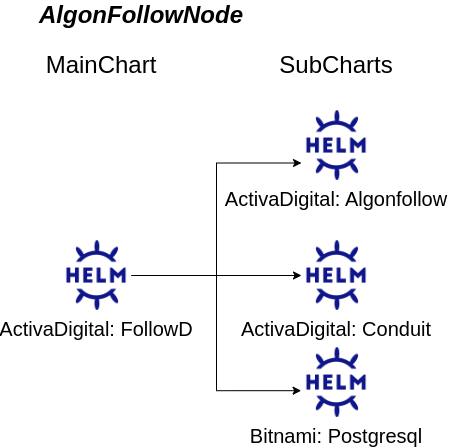

# AlgonFollowNode

> this is the fully integrated main chart that includes dependency on Activadigital: Conduit chart, Activadigital: Algonfollow chart and Bitnami: Postgres chart


> this is the status of the two generated subcharts (Algonfollow and Conduit)


This repo provide Algorand follow mode helm chart with Conduit and Postgres integration compatible with testnet and mainnet. This is based on Algorand node stable channel.





## Prerequisites

- Minikube https://minikube.sigs.k8s.io/docs/handbook/
- Minikube ingress https://kubernetes.io/docs/tasks/access-application-cluster/ingress-minikube/
- kubectl https://kubernetes.io/docs/tasks/tools/install-kubectl/
- helm https://helm.sh/docs/intro/install/
- jq https://stedolan.github.io/jq/download/

### Outgoing connections

The node must be able to reach:

1. GitHub over HTTPS to get the consensus protocols
   - <https://github.com/algorandfoundation/specs/tree/*>
2. AmazonAWS over HTTPS to get fast catchup's catchpoints
   - TestNet: <https://algorand-catchpoints.s3.us-east-2.amazonaws.com/channel/testnet/latest.catchpoint>
   - MainNet: <https://algorand-catchpoints.s3.us-east-2.amazonaws.com/channel/mainnet/latest.catchpoint>
3. Relay nodes over TCP ports 4160 (mainnet) and 4161 (testnet); to get the list of relay nodes use these DNS queries:
   - TestNet: `dig _algobootstrap._tcp.testnet.algorand.network SRV +short`
   - MainNet: `dig _algobootstrap._tcp.mainnet.algorand.network SRV +short`
   All relay nodes should be:
   - MainNet: `*.algorand-mainnet.network`
   - TestNet: `*.algorand-testnet.network`

## Install

```sh
helm repo add mortega89 https://mortega89.github.io/algonfollow
helm repo update
helm upgrade --install followd -n namespace mortega89/Followd --create-namespace
```

## Configuration

The helm default values are a good starting point. [values.yaml](MainChart/Followd/values.yaml)

## Usage

### Access node via ingress

1. Copy URL from minikube
```
minikube service list algon -n algon
```

Example output:
| NAMESPACE | NAME  | TARGET PORT |            URL             |
| algon     | algon | http/8080   | http://192.168.64.12:31902 |


1. Make request to node from localhost
```
curl http://${URL_FROM_MINIKUBE_SERVICE_LIST_COMMAND}/v2/status -H  "X-Algo-API-Token: $ALGON_API_TOKEN" -v | jq .
```

### Access node via minikube tunnel

1. Run `minikube tunnel`

1. In a new terminal run:
```
export ALGON_IP=`kubectl -n algon get svc algon -o json | jq -r '.status.loadBalancer | .ingress[].ip'`
export ALGON_API_TOKEN=`kubectl -n algon get secrets/algon-api-token --template="{{index .data \"algod.token\" | base64decode}}"`
echo "\n\nAlgorand Node IP: $ALGON_IP\nAlgorand Node Port: 8080 \nAlgorand API Token: $ALGON_API_TOKEN\n"
curl http://$ALGON_IP:8080/v2/status -H  "X-Algo-API-Token: $ALGON_API_TOKEN" -v | jq .
```

1. The Algorand node is now accessible under **algon.local**.

## Docker Image

The algon docker image is hosted on GHCR:

```
docker pull ghcr.io/activadigital-it/algon
```
